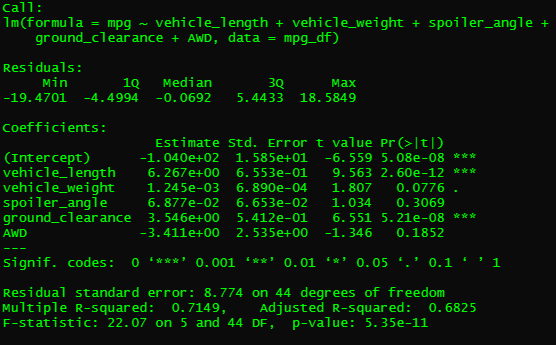
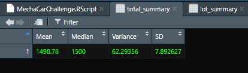
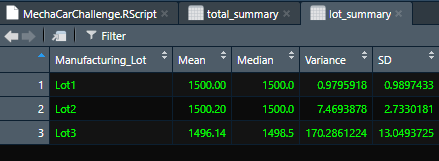
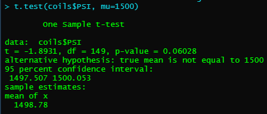
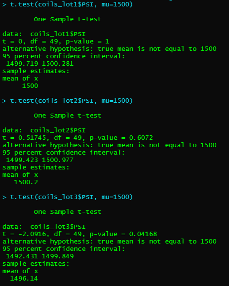

# MechaCar_Statistical_Analysis

### *Files*:
- [MechaCarChallenge](MechaCarChallenge.RScript)

## **Overview**:

## **Summary of Results**:

### *Linear Regression to Predict MPG*:
- 
The summary created from the linear regression function provided useful insight into which key factors influenced the car's resulting MPG rating. The main findings from creating this summary were:
  - The vehicle's length (at a p-value of 2.6 * 10^-12) and the vehicle's ground clearance (at a p-value of 5.21 * 10^-8) were two variables that provided non-random amounts of variance to the MPG values based on this dataset.
  - The slope of the linear model is not considered to be zero because the returned p-value of 5.35 * 10^-11 is below the necessary p-value threshold of 0.05. This shows there is enough evidence to reject the null hypothesis, and to claim the linear model has a slope that can predict the data points with a sufficient degree of accuracy.
  - This linear model does predict the MPG rating of MechaCar prototypes effectively due to the R-squared value of 0.715, indicating a high correlation coefficient. With the R-squared value showing a greater closer value to 1.0 than 0.5, it predicts the MPG values with a much higher degree of accuracy than random chance. With this R-squared value combined with the p-value supporting a much greater probability of accuracy than random chance, this linear model can certainly be considered effective in predicting the MPG values. Despite these pieces of evidence, however, the p-values for the different variables shown in the summary indicate there are not many significant variables that can be identified as key factors in the model. This means the model can predict with some efficiency the known data values, but the accuracy of predicting future values that are not yet known is questionable and can't necessarily be considered reliable.

### *Summary Statistics on Suspension Coils*:
- With design specifications relating to the MechaCar's suspension coil manufacturing, unfortunately the variance in the pressure levels recorded for the coils in this dataset do not satisfy the required specifications in all cases. For the coils produced from all manufacturing lots considered as a total, the variance is within the acceptable range; as shown in the screenshot below for the values calculated with all records considered.
- 
- Despite these successful results in the total summary table, when considered individually, the variance in suspension coil pressure ratings recorded from manufacturing lot 3 exceed the specified limit by a difference of over 70 PSI. As shown in the screenshot below: when combined with the standard deviation value calculated, the coils produced at Lot3 are not up to the consistency of quality required.
- 

### *T-Tests on Suspension Coils*:
Running a T-test for the product records of all manufacturing lots together and running a test for each lot individually shows not only a clear difference in the calculated mean values in each case compared to the given population mean of 1500, it also shows where the deviations from the population mean came from and which lot had greater variation than others. 
#### Overall Test: 
  The initial T-test run for all suspension coil records against the population mean is presented in the screenshot below:
- 
- This intial T-test showed a t value of -1.89, and gave a p-value of 0.06 - together the variation is not particularly striking and working with the common threshold for p-values to be below 0.05 for rejection of the null hypothesis, the difference between the mean values is not enough to consider them statistically significant.
#### Individual Lot Tests:
  When considering the mean coil PSI values for each lot individually, the t-values and p-values give some context for why the values were off in the overall test but, not significantly so. As seen in the screenshot listed below:
- 
- The first lot's values have an ideal alignment with the population mean value, resulting in the t-value being 0 and the p-value being 1. 
- The second lot's values, however, show some slight variation but with a t-value of less than 1.0 and a p-value of more than 0.05, the variations are still not statistically significant.
- The third lot's t-test shows a t-value of -2.1, which surpasses the overall t-value result and the lot's records have a p-value of 0.042, which makes it not only statistically significant but also allows for rejection of the null hypothesis. With the fact that this lot's statistical values making it stand out, the analysis shows how lot3's individual mean PSI values are enough to strongly impact the calculated results for all three lots' manufacturing records together.
### *Study Design: MechaCar vs Competition*:

-
-
-
-

## **Conclusions**:
